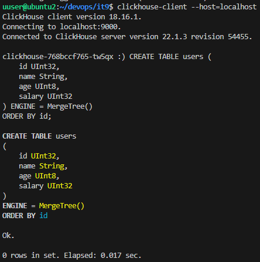
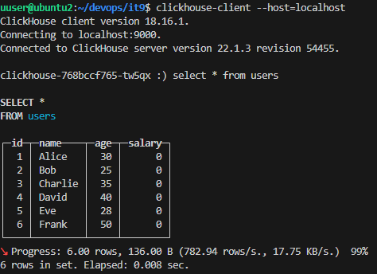

**Задание 9.**

**Миграция данных из PostgreSQL в ClickHouse в Minikube**

**Цель: Научиться развертывать PostgreSQL и ClickHouse в Kubernetes с использованием Minikube, и реализовать процесс миграции данных из PostgreSQL в ClickHouse.**

Описание задания: 

- Запустите Minikube с достаточными ресурсами.
- Создайте файл postgres-deployment.yaml для развертывания PostgreSQL.
- Создайте файл clickhouse-deployment.yaml для развертывания ClickHouse.
- Подключитесь к PostgreSQL с помощью psql.
- Выполните следующие SQL-запросы для создания таблицы и добавления данных:

CREATE TABLE users (

`    `id SERIAL PRIMARY KEY,

`    `name VARCHAR(100),

`    `age INT,

`    `salary INT

);

INSERT INTO users (name, age, salary) VALUES

('Alice', 30, 70000),

('Bob', 25, 50000),

('Charlie', 35, 100000),

('David', 40, 120000),

('Eve', 28, 60000),

('Frank', 50, 150000);

- Подключитесь к ClickHouse с помощью clickhouse-client.
- Выполните следующий SQL-запрос для создания таблицы в ClickHouse:

CREATE TABLE users (

`    `id UInt32,

`    `name String,

`    `age UInt8,

`    `salary UInt32

) ENGINE = MergeTree()

ORDER BY id;

- В локальной среде (не в Minikube) создайте файл migration.py.
- Убедитесь, что PostgreSQL и ClickHouse доступны через портфорвардинг, и запустите скрипт, который перенесет данные из PG в ClickHouse.

В качестве решения, разместите в репозитории 2 yaml-файла развертывания БД, файл migration.py, а также сделайте скриншоты того, что в ClickHouse данные появились.

Результат задания — после выполнения задания у вас будет развернут Minikube-кластер с PostgreSQL и ClickHouse, настроена миграция данных между этими системами и успешно завершен процесс миграции. 

**Шаг 1. Установка и запуск Minikube**

1. **Убедитесь, что Minikube установлен:**
   1. Установите Minikube, если он не установлен. 
1. **Запустите Minikube с достаточными ресурсами:**

minikube start --cpus=4 --memory=8192

1. **Проверьте статус кластера:**

kubectl cluster-info

-----
**Шаг 2. Создание и развертывание PostgreSQL**

1. **Создайте файл postgres-deployment.yaml:**
1. apiVersion: apps/v1
1. kind: Deployment
1. metadata:
1. `  `name: postgres
1. spec:
1. `  `replicas: 1
1. `  `selector:
1. `    `matchLabels:
1. `      `app: postgres
1. `  `template:
1. `    `metadata:
1. `      `labels:
1. `        `app: postgres
1. `    `spec:
1. `      `containers:
1. `      `- name: postgres
1. `        `image: postgres:15
1. `        `ports:
1. `        `- containerPort: 5432
1. `        `env:
1. `        `- name: POSTGRES\_USER
1. `          `value: "admin"
1. `        `- name: POSTGRES\_PASSWORD
1. `          `value: "password"
1. `        `- name: POSTGRES\_DB
1. `          `value: "test\_db"
1. ---
1. apiVersion: v1
1. kind: Service
1. metadata:
1. `  `name: postgres
1. spec:
1. `  `ports:
1. `  `- port: 5432
1. `  `selector:
1. `    `app: postgres

1. **Примените конфигурацию:**

kubectl apply -f postgres-deployment.yaml

1. **Проверьте статус:**

kubectl get pods

-----
**Шаг 3. Создание и развертывание ClickHouse**

1. **Создайте файл clickhouse-deployment.yaml:**
1. apiVersion: apps/v1
1. kind: Deployment
1. metadata:
1. `  `name: clickhouse
1. spec:
1. `  `replicas: 1
1. `  `selector:
1. `    `matchLabels:
1. `      `app: clickhouse
1. `  `template:
1. `    `metadata:
1. `      `labels:
1. `        `app: clickhouse
1. `    `spec:
1. `      `containers:
1. `      `- name: clickhouse
1. `        `image: yandex/clickhouse-server:latest
1. `        `ports:
1. `        `- containerPort: 9000
1. `        `- containerPort: 8123
1. `        `env:
1. `        `- name: user
1. `          `value: "admin"
1. `        `- name: password
1. `          `value: "password"
1. ---
1. apiVersion: v1
1. kind: Service
1. metadata:
1. `  `name: clickhouse
1. spec:
1. `  `ports:
1. `  `- port: 9000
1. `    `targetPort: 9000
1. `    `protocol: TCP
1. `    `name: http
1. `  `selector:
1. `    `app: clickhouse

1. **Примените конфигурацию:**

kubectl apply -f clickhouse-deployment.yaml

1. **Проверьте статус:**

kubectl get pods

-----
**Шаг 4. Работа с PostgreSQL**

1. **Установите портфорвардинг для PostgreSQL:**

kubectl port-forward svc/postgres 5432:5432

1. **Подключитесь к PostgreSQL:**

psql -h localhost -U admin -d test\_db

1. **Создайте таблицу и добавьте данные:**

   CREATE TABLE users (

   `    `id SERIAL PRIMARY KEY,

   `    `name VARCHAR(100),

   `    `age INT,

   `    `salary INT

   );

   INSERT INTO users (name, age, salary) VALUES

   ('Alice', 30, 70000),

   ('Bob', 25, 50000),

   ('Charlie', 35, 100000),

   ('David', 40, 120000),

   ('Eve', 28, 60000),

   ('Frank', 50, 150000);

   

-----
**Шаг 5. Работа с ClickHouse**

1. **Установите портфорвардинг для ClickHouse:**

kubectl port-forward svc/clickhouse 9000:9000

1. **Подключитесь к ClickHouse:**

clickhouse-client --host=localhost

1. **Создайте таблицу в ClickHouse:**

   CREATE TABLE users (

   `    `id UInt32,

   `    `name String,

   `    `age UInt8,

   `    `salary UInt32

   ) ENGINE = MergeTree()

   ORDER BY id;

   

-----
**Шаг 6. Миграция данных (Python-скрипт)**

1. **Создайте файл migration.py:**
1. import psycopg2
1. from clickhouse\_driver import Client

1. # PostgreSQL connection
1. pg\_conn = psycopg2.connect(
1. `    `dbname="test\_db",
1. `    `user="admin",
1. `    `password="password",
1. `    `host="localhost",
1. `    `port=5432
1. )
1. pg\_cursor = pg\_conn.cursor()

1. # Fetch data from PostgreSQL
1. pg\_cursor.execute("SELECT id, name, age FROM users;")
1. rows = pg\_cursor.fetchall()
1. # ClickHouse connection
1. ch\_client = Client(host='localhost', port=9000)
1. # Insert data into ClickHouse
1. for row in rows:
1. `    `ch\_client.execute("INSERT INTO users (id, name, age) VALUES", [row])

1. print("Migration completed successfully!")

1. # Close connections
1. pg\_cursor.close()
1. pg\_conn.close()

1. **Убедитесь, что PostgreSQL и ClickHouse доступны через портфорвардинг.**
1. **Запустите скрипт:**

   sudo apt install python-is-python3

   sudo apt install python3-psycopg2

   sudo apt install python3- clickhouse\_driver

python migration.py

-----
**Шаг 7. Проверка миграции данных**

1. **Подключитесь к ClickHouse и проверьте данные:**

SELECT \* FROM users;

